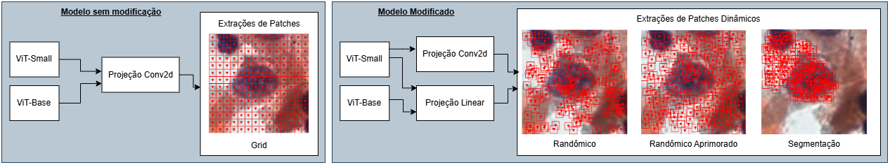

# Aplicação de Patches Dinâmicos em Vision Transformers em exames de Papanicolau

## Tempo de Desenvolvimento do Projeto

<a href="https://wakatime.com/badge/user/e5eaffb7-e096-4b18-a852-b6d7066b0044/project/75bd04cf-06b9-44bc-97b5-65029d479467"></a>

## Explicações

- Este trabalho explora a aplicação de Vision Transformers (ViTs) na classificação de imagens de exames de Papanicolau, com o objetivo de identificar alterações citológicas. Foram realizados experimentos de _fine-tuning_ com os modelos Tiny, Small e Base, sendo os modelos Small e Base utilizados como _baseline_ para comparação. O foco da pesquisa está na modificação do módulo de extração de patches, que, no modelo padrão, utiliza projeção convolucional baseada em um grid fixo.

<p align="center">
  
  <br>
  <em>Entrada e Saída do Vision Transformer</em>
</p>

- Neste projeto, propõe-se a substituição dessa abordagem tradicional por técnicas dinâmicas de extração de patches, combinando projeções lineares e convolucionais. Três métodos foram desenvolvidos e analisados: **Seleção Randômica (SR)**, **Randômica Aprimorada (RA)** e **Seleção por Segmentação (SS)**. Essas técnicas pretendem aprimorar a representatividade dos patches extraídos, explorando informações das imagens para melhorar a acurácia na classificação.

## Documentos

- Pesquisa publicada no [Simpósio Brasileiro de Computação Aplicada à Saúde (SBCAS 2025)](https://sol.sbc.org.br/index.php/sbcas/article/view/35495).
- O **artigo** mais atual dessa pesquisa está nesse arquivo [AQUI](https://github.com/viniciushgiovanini/vit-dynamic-patches/blob/master/doc/artigo_publicado_SBCAS2025.pdf).
- O **artigo** de desenvolvido desse trabalho pode ser encontrado clicando [AQUI](https://github.com/viniciushgiovanini/vit-dynamic-patches/blob/dev/doc/TCC2%20-%20Vinicius%20Henrique%20Giovanini%20-%20Ultima%20Versao%20Pos%20banca.pdf).

## Download do Dataset e Pré-Processamentos

- Para gerar os patches recortados e balanceados, é necessário extrair a base de dados presente no site do [CRIC](https://database.cric.com.br/downloads), e colocar as 400 imagens de exames de papanicolau no diretório **data/base/**. Além de colocar o arquivo **classifications.csv** que contem as informações sobre as 11.500 celulas presente no dataset no path **data/classifications.csv**.
- Para rodar as etapas de pré-processamento basta executar o notebook denominado **preprocessamento.ipynb** na raiz do projeto, esse ntb contem as etapas.
  - Criação de todos os diretórios necessários, incluindo a pasta data
  - Recorte do dataset
  - Dvisão do dataset em Treino, Validação e Teste
  - Aumento de Dados
  - Redução de Dados
  - Geração da Lista de Centros para cada núcleo da imagem para as abordagens RA e SS.
- No artigo o balanceamento de dados default ficou como na tabela abaixo.

<br>
<center>

| **Classe**     | **ASC-H** | **ASC-US** | **HSIL** | **LSIL** | **NFIL** | **SCC** |
| -------------- | --------- | ---------- | -------- | -------- | -------- | ------- |
| **Train**      | 1.000     | 1.000      | 1.000    | 1.000    | 1.000    | 1.000   |
| **Validation** | 185       | 122        | 341      | 272      | 1.356    | 33      |
| **Test**       | 148       | 96         | 272      | 217      | 1.084    | 25      |

</center>

## Rodando o ViT

- O arquivo principal para treinamento do ViT padrão sem modificação é denominado **traning.py**, localizado na raiz do projeto, sendo necessário passar as pastas de teste e validação.

- Para rodar o ViT custom, com projeção linear ou convolucional deve rodar o arquivo denominado **traning_custom.py**. Esse método precisa do Pré-Processamento, que consiste na geração dos arquivos pickle de centros de todos os patches, que fica localizado dentro da pasta **centros_pre_salvos**.
  - segmentacao_dicionario.pkl
  - randomico_melhorado_identificador_por_imgname.pkl

## Fluxos de Teste

- Este projeto propõe os métodos **Seleção Randômica (SR)**, **Randômica Aprimorada (RA)** e **Seleção por Segmentação (SS)**, como mostrado na figura abaixo. Para utilizar o modelo custom de ViT, é necessário realizar a geração da lista de centros, que basicamente são os pixels centrais de cada patch, para a abordagem SS e a RA, na qual não é possível gerar esses pixels centrais durante o treinamento, dessa forma é necessário gerar essas lista previamente, que é possivel através do notebook **preprocessamento.ipynb**, nota-se para cada abordagem será salvo a lista de centros para as 11.500 imagens, esse é um processo demorado, cerca de 5 horas para cada abordagem, gerando assim os arquivos pickle (pkl).

- O trabalho propõe a utilização dos modelos ViT-Base e ViT-Small, com projeção convolucional e extração por Grid, comparado com os mesmos modelos, através de projeção linear no modelo ViT-Base e no ViT-Small, e com projeção convolucional somente no ViT-Small, como ilustrado na figura abaixo.

<br>
<center>
<figure>

  <figcaption>Fluxos de Testes do Vision Transformer</figcaption>
</figure>
</center>
<br>

## IMPORTANTE ⚠️

- Para conseguir rodar os códigos de fine-tuning do modelo tradicional e do modelo custom **é necessário uma gpu NVIDIA para o CUDA, além de rodar em LINUX, ou no windows através WSL**, com linux.

## Instalando venv

- Crie a virtual environment no dirétorio raiz.

```shelll
python -m venv venv
```

- Entre na venv (Windows Powershell)

```shell
cd venv/Scripts/
./activate
```

- Entre na venv (Linux)

```shell
source venv/bin/activate
```

- Com ela ativada instale as dependências

```shell
pip install -r requirements.txt
```

- Verifique a instalação

```shell
pip list
```

## Verificação do CUDA

- Verifique a versão do Cuda instalada por default no WSL2

```
nvidia-smi
watch -n 1 nvidia-smi
```

## Diretórios

- Todos os notebooks estão lendo dados da pasta **data**.

```md
.
├── README.md
├── classes
│   ├── CustomImageFolder.py
│   ├── Validate.py
│   ├── dynamic_patches.py
│   ├── modelo.py
│   ├── modelo_binario.py
│   ├── modelo_custom.py
│   ├── modelo_custom_conv2d.py
│   ├── patch_visualizer.py
│   └── Preprocessamento.py
├── data
│   ├── base
│   ├── base_mascara
│   ├── base_recortada
│   ├── base_save
│   ├── base_temporaria
│   ├── base_treinamento
│   ├── centros_pre_salvos
│   ├── classifications.csv
├── grafico-animado.py
├── graph
├── lightning_logs
├── models
├── notebook
│   ├── Heatmap
│   ├── Mask
│   ├── conv2d.py
│   ├── doc
│   ├── linear.py
│   ├── patch.ipynb
│   ├── pre-processamento
│   └── tratamento.ipynb
├── requirements.txt
├── preprocessamento.ipynb
├── avaliar-modelo.py
├── training_custom.py
├── training.py
└── validacao.ipynb
```

- O path **base** contém o dataset original, e o **base_temporaria** é uma copia, para manter os dados.
- O path **base_recortada**, possui subpastas com cada tipo de célula e com as celulas recortada de um tamanho 90 para os lados por padrão.
- O diretório de notebooks existe pois foi usado para debugar os algoritmos criados principalmente de pré-processamento e as projeções, todos ja forám para classes como a **Preprocessamento.py**

## Rodando o Fine Tuning (Modelo Padrão)

Para rodar o finetuning/treinamento do vision transformers sem modificação, é necessario a pasta **data/base_treinamento/** com as pastas train, test e validation com as respectivas imagens dentro, os gráficos de acurácia e validação são salvos na pasta **graph/** na raiz no final do treinamento.

- Visualizar os parámetros do código

```
python3 traning.py --help
```

- Exemplo de execução do código

```
python3 training.py --model small16 --epocas 10 --learningrate 1e-10 --batchsize 64
```

## Rodando o Fine Tuning (Modelo Custom)

Para rodar o Fine Tuning com o modelo custom temos que setar o PDE (Patch Dynamic Extration) e o tipo de projeção, alem do patch size.

- Visualizar os parámetros do código

```
python3 traning_custom.py --help
```

- Exemplo de execução do código

```
python3 training_custom.py --model small16 --projecao linear --pde grid --patchsize 16 --epocas 10 --learningrate 1e-10 --batchsize 64
```

## Linguagens de Desenvolvimento

&nbsp;
&nbsp;


## Desenvolvimento ✏

**Feito por**: [Vinícius Henrique Giovanini](https://github.com/viniciushgiovanini)  
**Orientador**: Alexei Machado
